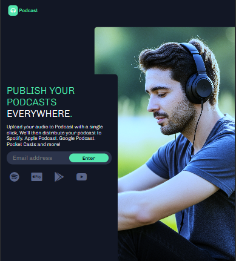
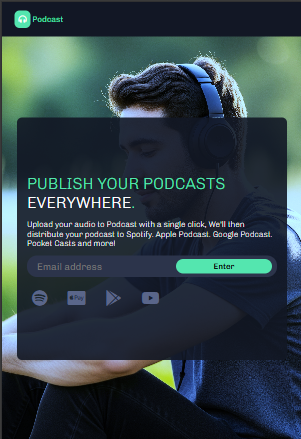

# 🎧 Podcast Page

Uma landing page moderna para divulgação de podcasts, com foco em responsividade e visual impactante.

## 📸 Preview





Acesse o projeto online
Veja a página no GitHub Pages [GitHub repo size](https://kevinbaudson.github.io/podcast/)

## 🔧 Tecnologias Utilizadas

- HTML5
- CSS3
- Font Awesome
- Responsividade com Media Queries

## 📱 Responsivo

A página se adapta para diferentes tamanhos de tela, inclusive:
- Imagem de fundo ocupa toda a tela em dispositivos menores (mobile)
- Conteúdo principal aparece sobre a imagem com fundo escurecido (overlay)
- Header permanece fixo e visível acima da imagem

## 🚀 Como Usar

1. Clone o repositório:

   ```bash
   git clone https://github.com/seu-usuario/podcast_page.git
   
2. Acesse o diretório do projeto:

bash
Copiar
Editar
cd podcast_page
Abra o index.html em seu navegador.

✨ Funcionalidades Futuras (ideias)
Integração com plataformas de podcast

Formulário funcional com backend

Animações com JavaScript
📄 Licença
Este projeto está sob a licença MIT. Sinta-se livre para usá-lo e modificá-lo!

🙋‍♂️ Autor
Kevin

Projeto desenvolvido para prática de HTML, CSS e responsividade.
